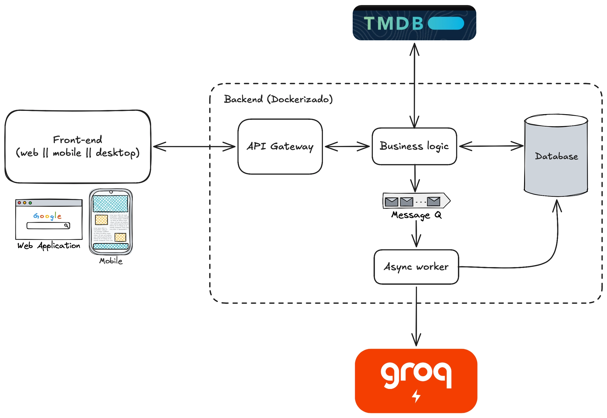

# Prueba técnica Instant

Prueba técnica para el puesto de junior software developer semana del 7 de septiembre de 2026

## Objetivo
Esta prueba técnica lo que busca es evaluar la capacidad de los candidatos de tomar decisiones sobre la mejor tecnología para cada componente, su capacidad de definir arquitectura de software que sea escalable no solo en rendimiento sino que en mantenibilidad de desarrollo y su capacidad de utilizar herramientas modernas impulsadas por LLMs para transformar un plan de desarrollo en un producto final.

Lo que se evaluara principalmente de la solución entregada es:

- Estructura en la que se definio el code base
- Tecnologías que se decidieron utilizar para cada componente (Todas las tecnologias involucradas son totalmente libres excepto el uso de Groq y de TMDB en las partes indicadas)
- Legibilidad del código (Clean code, codigo auto-explicativo y claro, modularización por capas de responsabilidad, etc etc)
- Que decisiones se tomaron para definir e implementar cada componente.

Para la prueba no solo esta permitido el uso de herramientas de LLM sino que se va a valorar positivamente que el participante conozca y sepa utilizar las mismas para ejecutar tareas de desarrollo. Ya que la persona que quede seleccionada en el día a día utilizara una cuenta de claude code de Instant para llevar a cabo sus tareas diarías.

Para la prueba se recomienda utilizar Claude Code CLI o si no se cuenta con una cuenta utilizar la alternativa OSS y gratuita conocida como OpenCode CLI. 

El sistema a desarrollar en si no posee una complejidad ni tamaño grande, por lo que las dos semanas que se ofrece a los candidato es para que tengan el tiempo para poder aprender a utilizar y investigar sobre estas herramientas, ya que no solo van a ser esenciales para el día a día dentro de Instant sino que lo serán para trabajar en cualquier empresa del rubro a día de hoy, por lo que lo que se lleven de esta instancia les va a aportar profesionalmente independientemente de si queden seleccionados o no.

## Consigna
Se quiere crear un sistema de recomendación de peliculas.

El sistema debe contar con las siguientes historias de usuario:

- Crear una cuenta (username/password)
- Logearse
- Listar peliculas (La list de peliculas se debe traer de ‘The Movie DB’ API, el link esta al final del documento)
- Los usuarios deben poder marcar de alguna forma que peliculas le gustaron.
- Listar la lista de peliculas que al usuario le gustaron
- Poder sacar de la list de “me gusta” una pelicula
- Recomedación de peliculas usando inferencia de un LLM (Integración con Groq). El usuario debe poder solicitar al sistema que le recomiende una pelicula basada en el perfil del usuario + su lista de “me gustas” , esta recomendación se persiste.
- Listar recomendaciones generadas por el LLM para el usuario.

Debido a que la API de Groq fuerza un rate-limit a nivel de modelo una integración apropiada para su servicio debe poder ajustar la demanda a ese rate limit con algoritmos adecuados de rate-limiting.

Para eso se recomiendo que el backend tenga un worker asincronico que consuma de una cola de eventos al paso del rate limits del modelo que se esta usando.

Cuándo un usuaro solicita una recomendación esta se encolaria en una queue de eventos para que el worker consuma acorde al rate-limit de la API de Groq.

Arquitectura de alto nivel de la solución esperada:

Para el front-end se deja también totalmente libre el formato, tecnología , etc. Puede ser una app mobile en Flutter, o una web en React, o una web en HTMLX, o una aplicación Desktop de algún tipo, etc. La única condicion que se pide es que se pueda correr en un sistema UNIX como Linux o Mac OS, por ejemplo una winform en C# no esta permitido ya que se ejecuta solo en windows.

No se espera que el front-end sea muy vistoso, ni en tiempo real ni nada parecido, con que funcione es suficiente, no va a aportar a la evaluación que el candidato gaste horas en hacer que la UI sea vistoza, ya que el enfoque principal de la prueba es ver como el candidato puede tomar decisiones de arquitectura de software y manejar agente de LLM para su implementación.

### !! Importante : El sistema final entregado debe estar 100% dockerizado con un docker compose. De forma que el que revise la solucion pueda levantarlo con un simple: docker compose up —build y ya empezar a utilizar la solución.

## Entrega
La entrega debe contener:
- Un documento dónde se especifiquen los endpoints definidos en la solución, un pequeño diagrama de la arquitectura final que se implemento y una justificación de porque se utilizo las tecnologias que decidieron utilizar.

- Todos los archivos .md utilizados en el proceso (CLAUDE.md, AGENTS.md, skills, MCPs utilizandos, etc)